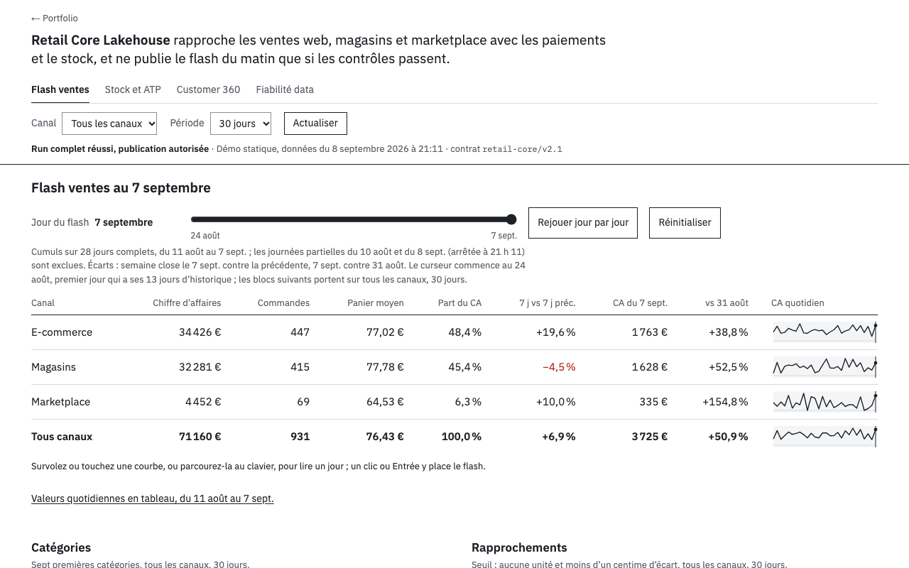

# Retail Core Lakehouse

[](https://github.com/Ikel0/retail-core-lakehouse/actions/workflows/ci.yml)

Plateforme data retail omnicanale qui rapproche ventes, paiements, stocks, événements et identités client avant de publier des indicateurs fiables.

Démo statique : [ikel0.github.io/retail-core-lakehouse](https://ikel0.github.io/retail-core-lakehouse/)



La capture montre le flash au 7 septembre 2026, tous canaux : 71 160 € et 931 commandes sur les 28 jours complets de la série, avec pour chaque canal l’écart de la semaine close contre la précédente et du jour contre le même jour de la semaine précédente. Le curseur « Jour du flash » place le tableau sur n’importe quel jour du 24 août au 7 septembre (le premier qui a 13 jours d’historique) ; « Rejouer jour par jour » avance d’un jour toutes les 1,5 s, avec Pause et Réinitialiser. Ce recalcul est fait dans le navigateur par `dashboard/flash.js`, à partir des séries quotidiennes publiées, et testé par `node --test tests/flash.test.js`. L’état du run en tête est calculé à partir des rapports, pas écrit en dur.

## Ce que le projet résout

- une vision commune des ventes web, magasins et marketplace ;
- un stock disponible à la promesse (ATP) tenant compte de la demande ;
- un Golden Record client sans exposer les emails ;
- une publication bloquée en cas d’écart métier ou de test en échec.

Les données sont synthétiques, déterministes et sans information personnelle réelle.

## Architecture

```text
8 sources retail
      │
      ▼
Apache Airflow · 6 tâches
      │
      ├── S3 Raw + Kinesis · API locales via LocalStack
      ├── modèle de contrôle Python + SQLite
      └── dbt Core + DuckDB · modèles, tests et snapshot
                          │
                          ▼
          réconciliation ventes / paiements / événements
                          │
                          ▼
             ATP · Customer 360 · KPI · cockpit
```

## Résultat vérifié

| Contrôle | Résultat |
|---|---:|
| Sources | 8 fichiers · 5 928 lignes |
| Ventes / paiements | 960 / 960 |
| Identités | 640 identités · 160 Golden Records |
| Événements | 3 160 |
| Qualité Python | 24 / 24 |
| dbt | 19 modèles · 78 tests · 1 snapshot |
| Réconciliation | 0 unité · 0,00 € |
| Airflow | 6 tâches · succès |

## Les quatre vues

| Vue | Décision couverte |
|---|---|
| Flash ventes | chiffre d’affaires, commandes et écarts par canal, catégories, rapprochements |
| Stock & ATP | disponibilité, demande, couverture et risque de rupture |
| Customer 360 | identité omnicanale, valeur client et segmentation RFM |
| Fiabilité data | Airflow, dbt, AWS local, contrôles et publishing gate |

## Ce qui tourne réellement

- Airflow orchestre le pipeline dans Docker ;
- dbt transforme et teste les données dans DuckDB ;
- Python construit un modèle de contrôle indépendant dans SQLite ;
- LocalStack émule les API S3, Kinesis et CloudWatch ;
- le handler compatible Lambda valide les événements dans le processus local ;
- Terraform décrit une cible AWS, sans déploiement automatique.

## Démarrage

Cockpit seul :

```bash
docker compose up --build -d retail-core
```

Plateforme complète :

```bash
docker compose --profile platform up --build -d
make airflow-test
```

- cockpit : [http://127.0.0.1:8042](http://127.0.0.1:8042)
- Airflow : [http://127.0.0.1:8080](http://127.0.0.1:8080)
- API AWS locale : `http://127.0.0.1:4566`

Sans Docker :

```bash
python3 run_demo.py
python3 serve.py
```

## Limites

- Les données sont synthétiques : `src/generate_data.py` utilise une graine fixe (42), les volumes sont donc identiques d’un run à l’autre, mais les dates sont recalées sur l’heure de génération.
- S3, Kinesis et CloudWatch sont émulés par LocalStack. Aucun compte AWS n’est utilisé et le code Terraform est validé (`terraform validate`), jamais appliqué.
- Le handler compatible Lambda tourne dans le processus Python local, pas dans AWS Lambda.
- La démo en ligne est un instantané : `build_static_site.py` précalcule les 12 combinaisons canal × période dans `static-data.js`. Le bouton « Actualiser » relit ces données, il ne relance pas le pipeline.
- Les chiffres Airflow, dbt et LocalStack de la démo viennent des rapports `reports/*.json` du dernier run complet (8 septembre 2026). Sans Docker, `python3 run_demo.py` ne produit que les contrôles Python : le tableau de bord affiche alors ces étapes comme non exécutées.
- La publication sur GitHub Pages (branche `gh-pages`) se fait à la main ; la CI vérifie le build mais ne déploie pas.

## Documentation

- [Architecture](docs/ARCHITECTURE.md)
- [État d’implémentation](docs/IMPLEMENTATION_STATUS.md)
